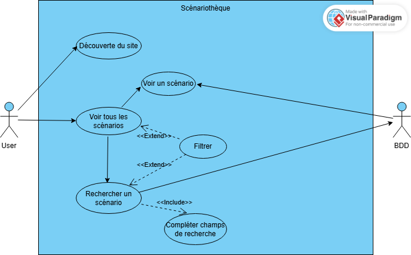
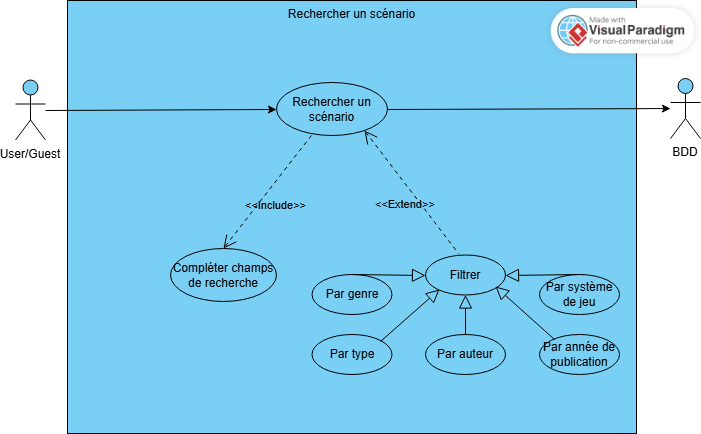
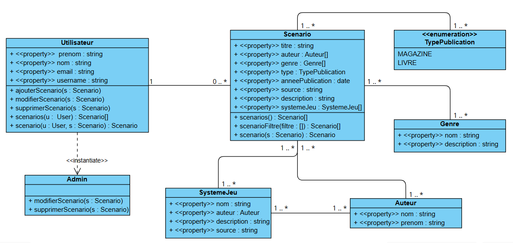
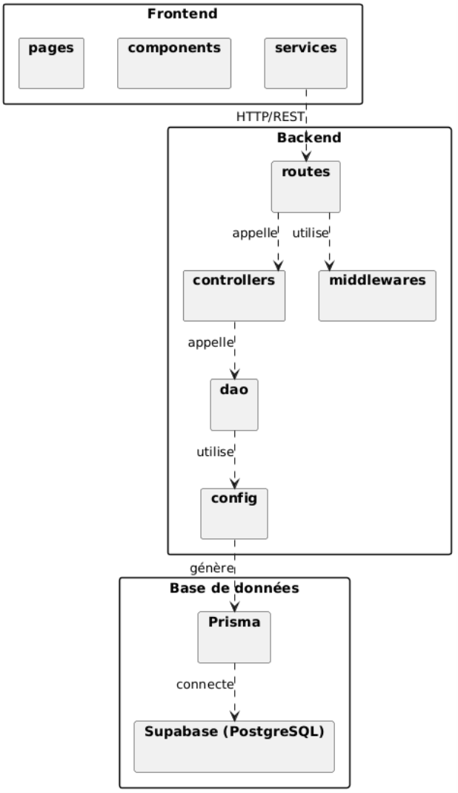
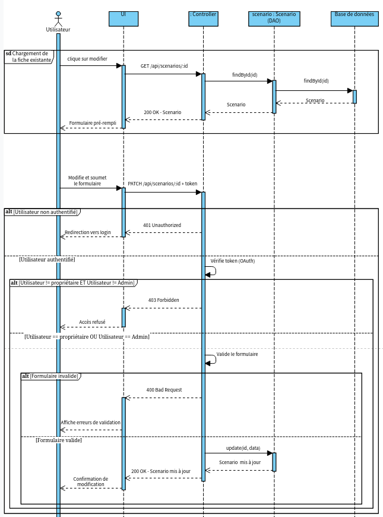

# Documentation — Scénariothèque

**Projet réalisé dans le cadre du module UML**

| | |
|---|---|
| **Équipe** | NEUZILLET Léo, MION Romaric, CARPENTIER Dimitri |
| **Dépôt GitHub** | https://github.com/Skaykleo/Scenariotheque |
| **Stack** | React, Node.js / Express, PostgreSQL (Supabase), Prisma |

---

## 1. Présentation du projet

Scénariothèque est une application web collaborative de recensement de scénarios de jeux de rôle publiés. Sur le modèle d'un Wikipedia, tout utilisateur connecté peut contribuer en ajoutant une entrée scénario — il n'est pas l'auteur du scénario, mais le contributeur de la fiche. L'objectif est de centraliser l'information : titre, auteur, système de jeu, genre, type de publication, année de parution, et lien vers la source.

Le projet est évalué dans le cadre d'un module UML en 4 jours, combinant conception UML en amont et réalisation technique en aval.

---

## 2. Fonctionnalités

### MVP

- Recensement de scénarios publiés (livres, magazines)
- Classification par genre (SF, Fantasy, Horreur, etc.) et par système de jeu (D&D, Pathfinder, etc.)
- Moteur de recherche par filtres : genre, type, auteur, système de jeu, année de publication
- CRUD scénario pour les utilisateurs connectés
- Gestion des droits : utilisateur (ses propres scénarios) et admin (tous les scénarios)

### Bonus

- Suivi de collection personnelle : wishlist, possédés, joués, maîtrisés
- Notation et commentaires par scénario
- Gestion d'amis et système de recommandations

---

## 3. User Stories

### Visiteur (non connecté)

| ID | En tant que | Je veux | Afin de |
|---|---|---|---|
| US1 | Visiteur | Consulter la liste des scénarios | Découvrir les scénarios disponibles |
| US2 | Visiteur | Consulter la fiche détaillée d'un scénario | Obtenir ses informations complètes |
| US3 | Visiteur | Filtrer les scénarios par genre, type, auteur, système de jeu ou année | Trouver un scénario correspondant à mes critères |
| US4 | Visiteur | Créer un compte et me connecter | Accéder aux fonctionnalités de contribution |

### Utilisateur connecté

| ID | En tant que | Je veux | Afin de |
|---|---|---|---|
| US5 | Utilisateur connecté | Ajouter un scénario | Contribuer au recensement collaboratif |
| US6 | Utilisateur connecté | Modifier un scénario que j'ai créé | Corriger ou compléter une fiche |
| US7 | Utilisateur connecté | Supprimer un scénario que j'ai créé | Retirer une entrée incorrecte |

### Administrateur

| ID | En tant que | Je veux | Afin de |
|---|---|---|---|
| US8 | Administrateur | Modifier n'importe quel scénario | Modérer et corriger le contenu |
| US9 | Administrateur | Supprimer n'importe quel scénario | Supprimer un contenu inapproprié |

---

## 4. Conception UML

### 4.1 Diagrammes de cas d'utilisation

#### Vue globale



Ce diagramme représente les interactions de haut niveau entre l'utilisateur et le système. On distingue la navigation passive (découverte du site, consultation) de la navigation active (recherche). La base de données est modélisée comme acteur secondaire.

#### Rechercher un scénario



Ce diagramme détaille le cas d'utilisation "Rechercher un scénario". La recherche inclut obligatoirement la complétion de champs (`<<Include>>`), et peut optionnellement être affinée par des filtres (`<<Extend>>`). Les filtres disponibles sont : par genre, par type, par auteur, par système de jeu et par année de publication.

#### Recensement scénario


Ce diagramme couvre les opérations CRUD réservées aux utilisateurs connectés. La création et la modification incluent obligatoirement une validation du formulaire (`<<Include>>`). L'API est modélisée comme acteur secondaire pour les opérations d'écriture.

---

### 4.2 Diagramme des classes



**Classes retenues**

| **Classe** | **Attributs** | **Méthodes** |
|---|---|---|
| `Utilisateur` | - prenom : String, - nom : String, - email : String, - username : String | + ajouterScenario(s : Scenario) : Scenario, + modifierScenario(s : Scenario) : void, + supprimerScenario(s : Scenario) : void, + scenarios() : Scenario[] |
| `Admin` | *(hérite de Utilisateur)* | + modifierScenario(s : Scenario) : void, + supprimerScenario(s : Scenario) : void |
| `Scenario` | - titre : String, - description : String, - anneePublication : Date, - type : TypePublication, - source : String | + scenarios() : Scenario[], + scenarioFiltre(filtre : []) : Scenario[], + scenario(s : Scenario) : Scenario |
| `Genre` | - nom : String, - description : String | — |
| `SystemeJeu` | - nom : String, - description : String, - source : String | — |
| `Auteur` | - nom : String, - prenom : String | — |
| `<<enumeration>> TypePublication` | LIVRE, MAGAZINE | — |

**Relations**

| **Relation** | **Type** | **Cardinalités** |
|---|---|---|
| `Admin` → `Utilisateur` | Héritage | — |
| `Utilisateur` → `Scenario` | Association | 1 — 0..* |
| `Scenario` → `Genre` | Association | 1..* — 1..* |
| `Scenario` → `SystemeJeu` | Association | 1..* — 1..* |
| `Scenario` → `Auteur` | Association | 1..* — 1..* |
| `SystemeJeu` → `Auteur` | Association | 1..* — 1..* |
| `Scenario` → `TypePublication` | Dépendance | 1 — 1 |

---

### 4.3 Diagramme des paquets



---

### 4.4 Diagrammes de séquence

#### Modifier un scénario



Ce diagramme modélise le flux de modification d'un scénario. Il couvre deux phases : le chargement de la fiche existante pour pré-remplir le formulaire, puis la soumission. La logique d'autorisation est centrale — un utilisateur ne peut modifier que ses propres scénarios, tandis qu'un administrateur peut modifier n'importe quel scénario.

#### Supprimer un scénario

> Diagramme à venir — en cours de réalisation.

#### Consulter la liste des scénarios avec filtres

> Diagramme à venir — en cours de réalisation.

#### Créer un scénario

> Diagramme à venir — en cours de réalisation.

#### Consulter la fiche détaillée d'un scénario

> Diagramme à venir — en cours de réalisation.

---

## 5. Architecture technique

### Stack

| Couche | Technologie |
|---|---|
| Frontend | React, JavaScript |
| Backend | Node.js, Express.js |
| Base de données | PostgreSQL (Supabase) |
| ORM | Prisma |
| Auth | OAuth (à définir) |
| Tests | Jest, jest-mock-extended |

### Structure du projet
```
Scenariotheque/
├── frontend/
│   └── src/
│       ├── pages/
│       ├── components/
│       └── services/
├── backend/
│   ├── src/
│   │   ├── config/        # Instance Prisma
│   │   ├── dao/           # Couche d'accès aux données
│   │   ├── controllers/   # Logique métier
│   │   ├── middlewares/   # Gestion des erreurs, auth
│   │   └── routes/        # Définition des endpoints
│   └── prisma/
│       ├── schema.prisma
│       └── migrations/
└── documentations/
```

---

## 6. Couche DAO

La couche DAO (Data Access Object) isole tous les appels à la base de données. Les controllers ne manipulent jamais Prisma directement — ils passent systématiquement par les DAO.

### DAO implémentés

| **DAO** | **Méthodes** |
|---|---|
| `scenario.dao.js` | findAll, findById, findByFiltres, create, update, remove |
| `genre.dao.js` | findAll, findById, create, update, remove |
| `systemeJeu.dao.js` | findAll, findById, create, update, remove |
| `auteur.dao.js` | findAll, findById, create, update, remove |

### Tests

Chaque DAO est couvert par une suite de tests unitaires avec **Jest** et **jest-mock-extended**. Le client Prisma est mocké — aucun appel réel à la base de données n'est effectué lors des tests.
```bash
Test Suites: 4 passed, 4 total
Tests:       25 passed, 25 total
```

---

## 7. Roadmap

- [x] Diagrammes de cas d'utilisation
- [x] Diagramme des classes
- [x] Diagramme des paquets
- [x] Mise en place du serveur Express
- [x] Schéma Prisma & migrations initiales
- [x] Couche DAO & tests unitaires
- [ ] Diagrammes de séquence *(en cours)*
- [ ] Controllers & routes API
- [ ] Interface de consultation (React)
- [ ] Système d'authentification (OAuth)
- [ ] Gestion de collection personnelle *(bonus)*
- [ ] Notation, commentaires, recommandations *(bonus)*
